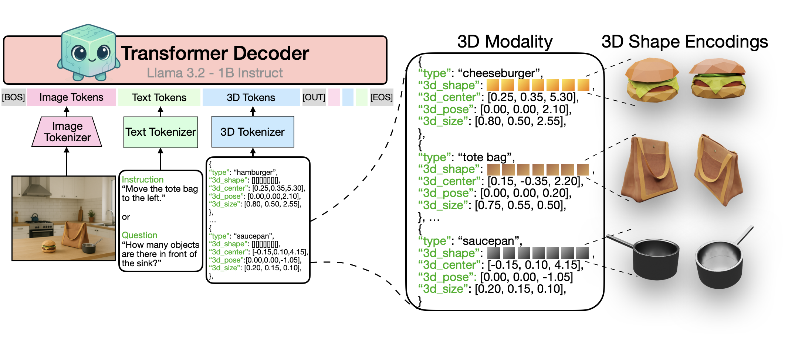

# An Autoregressive Exploration of 3D Multi-Modal LLMs

This repository contains the code for the webpage and demo for [An Autoregressive Exploration of 3D Multi-Modal LLMs](https://glab-caltech.github.io/3d-mllm/) 

[Aadarsh Sahoo](https://aadsah.github.io/), [Georgia Gkioxari](https://gkioxari.github.io/).

#### [Project Page](https://glab-caltech.github.io/3d-mllm/) | [Paper]() | [Dataset](https://huggingface.co/datasets/aadarsh99/3d-mllm-datasets-and-codebooks) | [BibTeX](#Citation)

